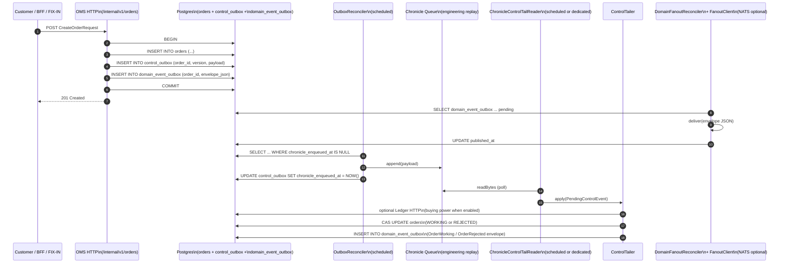

# OMS slice-1 architecture

## Cash / securities boundary

Slice 1 owns the **securities** side: orders, executions, positions. The cash
side stays in [Ledger](../../ledger). The OMS calls Ledger for inflight /
settle / commit; Ledger remains the system of record for money movement.

## Slice 3f status note

The control-plane flow described below is the legacy slice-1 chronicle path. Phase 3 slice 3f of [`oms-aeron-cluster-substrate`](../../system-documentation/plans/oms-aeron-cluster-substrate.md) deleted `control_outbox` + `OutboxReconciler`; the cluster's events recording is now the durable handoff and `OmsPostgresProjector` (slice 2d) writes `orders.status=WORKING` + `domain_event_outbox(OrderWorking)` + `control_decisions(PASS)` from `OrderAdmittedEvent` directly. `oms-fix-egress` (slice 3a–d) reads the same recording for outbound NOS. The diagram below is preserved for reference until slice 3g rewrites this page.

## Control-plane flow (slice 1)

**Diagram scope:** the **REC** ↔ **PG** / **CHR** block is the `OutboxReconciler` append path. Phase 1c of the [Aeron Cluster substrate plan](../../system-documentation/plans/oms-aeron-cluster-substrate.md) deleted the `IngressControlChroniclePublisher` after-commit path; every JVM now appends to Chronicle through `OutboxReconciler` (Phase 2 replaces this with cluster-egress projectors). Spring profile **`oms-control-worker`** removes the **Client → API** accept path so REC drains shared Postgres; **`management.server.port`** defaults to **8089** (`OMS_CONTROL_WORKER_MANAGEMENT_SERVER_PORT`) so Actuator is off the main HTTP port. **`oms.grpc.enabled` must be `false`** on that JVM (validator). Runbook: [runbooks/oms-control-worker.md](../runbooks/oms-control-worker.md). The **`test`** profile uses a NoOp journal.

`control_outbox.payload` is JSONB holding a small wrapper (`v` + base64 protobuf `ControlPendingEvent` with **`google.protobuf.Timestamp`** fields for wall times). Chronicle excerpts are **`OMS\\x01` + protobuf** only. **`chronicle_materialized_at`** is set on the Chronicle message (not the outbox row) when materializing the append, for pipeline / OTel lag. **`OutboxReconciler`** performs the append after `reconciler-age-ms` (see topology plan).

The four invariants encoded by this diagram:

1. **Postgres COMMIT happens before any Chronicle append.** Always — via **`OutboxReconciler`** after `reconciler-age-ms`.
2. **The control outbox row is inside the same transaction** as the orders row, so
   crash recovery is trivial: anything visible in `orders` has a matching
   `control_outbox` row (or a `chronicle_enqueued_at` timestamp). **`OrderAccepted`**
   domain fanout uses the same transaction via `domain_event_outbox`.**
3. **Domain events on NATS / drop copy are delivered only after commit.**
   `OrderAccepted` is written to `domain_event_outbox` in the ingress transaction;
   **`DomainFanoutReconciler`** publishes the full JSON envelope after commit.
   **`OrderWorking`** and **`OrderRejected`** use the same outbox pattern inside
   the tailer's transaction after successful CAS. Enable NATS with `OMS_NATS_ENABLED=true`;
   otherwise a no-op `FanoutClient` counts deliveries only.
4. **Tailer mutations are CAS on `orders.version`.** Re-applying the same
   payload is a no-op.

`ChronicleControlTailReader` polls Chronicle (`readBytes`); it does not use a push callback from the queue. Tailer identity is **`OMS_CHRONICLE_CONTROL_TAIL_ID`** (default `oms-control`); run **one** active tail per shared **`OMS_CHRONICLE_QUEUE_DIR`** in production unless you have an explicit multi-reader design — see [chronicle-tail-driver.md](chronicle-tail-driver.md). **Horizontal ingress** JVMs (`oms-ingress-replica`) omit the tail reader (`oms.chronicle.control-tail-enabled=false`) and use **`oms.control.postgres-write-path=ingress`** for admission in the accept transaction — see [runbooks/oms-ingress-replica.md](runbooks/oms-ingress-replica.md). **Wake latency** (how soon the next `readBytes` runs after an append) depends on `OMS_CHRONICLE_TAIL_DRIVER` (`scheduled` vs `dedicated`) and related settings — see that doc. Other pipeline stages (outbox reconciler, FIX outbound poll, etc.) remain separate schedulers or workers.

## High availability

Slice 1 runs single-instance. HA arrives in slice 1.5:

- Shard ownership via Postgres advisory lock OR k8s lease (decision pinned
  in slice 1.5 ADR).
- On primary failure, the standby:
  - Acquires the shard lease.
  - Reads `orders` and `control_outbox` to reconstruct in-flight state.
  - Picks up `control_outbox` rows where `chronicle_enqueued_at IS NULL`.
- Chronicle remains shard-local. Replicated journals (Chronicle Enterprise,
  Aeron Cluster, Kafka) are an upgrade path; Postgres-driven recovery is
  the slice-1.5 default.

## What about Chronicle losing data?

Because the outbox is the source of truth for "needs to be appended to
Chronicle", losing a Chronicle file is recoverable:

1. Restart the OMS pointed at a fresh queue directory.
2. The reconciler re-discovers all unsent rows in `control_outbox` and
   replays them.
3. Engineers replaying the journal are aware they must use a Postgres
   snapshot at the same time horizon — Chronicle alone is not enough.

This is what we mean by "Chronicle is engineering replay only, not a
regulatory system of record."

## What about NATS losing events?

Domain fanout uses a **transactional outbox** (`domain_event_outbox`). If NATS is
unreachable, rows stay pending with `published_at IS NULL` until
`DomainFanoutReconciler` succeeds; the trading system of record in Postgres is
unaffected. Tune age, batch, and interval with `OMS_DOMAIN_EVENTS_*`.
