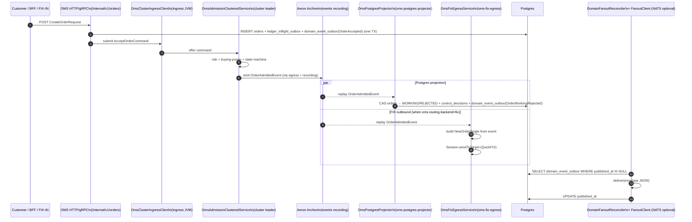

# OMS architecture

## Cash / securities boundary

OMS owns the **securities** side: orders, executions, positions. The cash side
stays in [Ledger](../../ledger). OMS calls Ledger for inflight / settle /
commit; Ledger remains the system of record for money movement.

## Cluster substrate (Phase 3 of `oms-aeron-cluster-substrate`)

Order admission and execution-report state are handled by an **Aeron Cluster**
clustered service (`OmsAdmissionClusteredService`). The cluster log is the
single, ordered, durable record of OMS state changes. Postgres is a downstream
**projection** rebuilt deterministically from the cluster's events recording.

The deployable JVMs are:

| Spring profile          | Role                                                                                    | Ingress side  |
|-------------------------|-----------------------------------------------------------------------------------------|---------------|
| `oms-cluster-node`      | MediaDriver + Archive + ConsensusModule + ClusteredServiceContainer                     | none          |
| `oms-ingress-replica`   | HTTP/gRPC accept; submits `AcceptOrderCommand` via `OmsClusterIngressClient`            | offers cmds   |
| `oms-postgres-projector`| Aeron Archive replay → Postgres projection (orders / executions / domain_event_outbox / market_context / positions / control_decisions) | none          |
| `oms-fix-egress`        | Singleton FIX SocketInitiator per route; outbound NOS replay + inbound venue ER → cluster | offers cmds   |

`TopologyWorkerProfiles` rejects mutually-incompatible role profiles on the
same JVM.

## Order admission flow



## Execution-report flow

```mermaid
sequenceDiagram
    autonumber
    participant BRK as Broker (FIX)
    participant FXE as oms-fix-egress\n(FixInboundClusterSink)
    participant ING as OmsClusterIngressClient
    participant CLU as OmsAdmissionClusteredService
    participant ARC as Aeron Archive
    participant PRJ as OmsPostgresProjector
    participant PG as Postgres

    BRK->>FXE: ExecutionReport / OrderCancelReject
    FXE->>FXE: translate to ApplyExecutionReportCommand
    FXE->>ING: submit command
    ING->>CLU: offer
    CLU->>CLU: (senderCompId, msgSeqNum) wire dedupe; (orderId, venueExecRef) state dedupe; cumQty / status state machine
    CLU->>ARC: emit ExecutionAppliedEvent
    ARC-->>PRJ: replay event
    PRJ->>PG: INSERT executions + CAS orders cum_filled_quantity / status + market_context merge + positions / position_history + free-riding attribution + domain_event_outbox(OrderPartiallyFilled / OrderFilled / OrderCancelled / OrderRejected) (one TX)
```

## Invariants

1. **The cluster log is the source of truth.** All projections (Postgres,
   FIX outbound) are derived from the events recording and are idempotent on
   replay.
2. **Postgres COMMIT happens after the cluster has emitted the event.** The
   projector advances `aeron_projector_cursor` only after the projection
   transaction commits; restart resumes from the last committed cursor.
3. **Domain events on NATS / drop copy are delivered only after commit.**
   Envelopes are written to `domain_event_outbox` inside the projector
   transaction; `DomainFanoutReconciler` publishes the JSON envelope only
   after the row is visible. Enable NATS with `OMS_NATS_ENABLED=true`.
4. **Mutations are CAS on `orders.version`.** Re-applying the same event is a
   no-op.
5. **Wire-level idempotency** on inbound venue ER comes from the `(senderCompId,
   msgSeqNum)` dedupe inside the cluster service (snapshot v3 covers this);
   **state-level idempotency** comes from the `(orderId, venueExecRef)` dedupe
   in the same service plus the `executions(account_id, venue_exec_ref)` unique
   constraint.

## High availability

- Cluster nodes run as a 3-replica StatefulSet per shard. ConsensusModule
  handles leader election; `oms-ingress-replica` clients reconnect to the new
  leader transparently.
- `oms-postgres-projector` and `oms-fix-egress` are stateless replays from the
  events recording; restart resumes from the cursor each maintains in
  Postgres (`aeron_projector_cursor`, `oms_fix_egress_cursor`). For FIX
  egress, exactly **one** replica may be active per route (broker constraint:
  one initiator per session).

## Loss / recovery

- **Lose a Postgres replica**: replay from cursor rebuilds projection rows
  deterministically; the cluster has not lost any state.
- **Lose a cluster node**: ConsensusModule replays the recording on the new
  leader; in-memory dedupe sets are restored from snapshots.
- **Lose the events recording**: catastrophic — recovery is engineering-grade
  (replay archived recording artifacts; reconcile against the last snapshotted
  cluster state). This is the failure mode the substrate is explicitly
  designed to make rare and observable.

## What about NATS losing events?

Domain fanout uses a **transactional outbox** (`domain_event_outbox`). If NATS
is unreachable, rows stay pending with `published_at IS NULL` until
`DomainFanoutReconciler` succeeds; the trading system of record in Postgres is
unaffected. Tune age, batch, and interval with `OMS_DOMAIN_EVENTS_*`.
