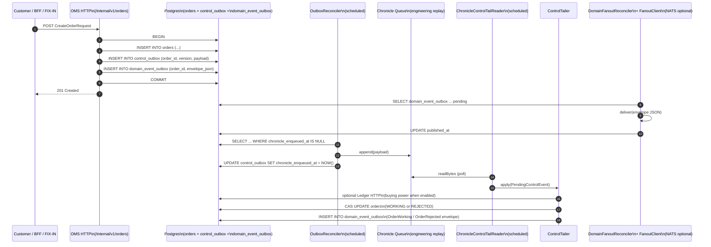

# OMS slice-1 architecture

## Cash / securities boundary

Slice 1 owns the **securities** side: orders, executions, positions. The cash
side stays in [Ledger](../../ledger). The OMS calls Ledger for inflight /
settle / commit; Ledger remains the system of record for money movement.

## Control-plane flow (slice 1)

The four invariants encoded by this diagram:

1. **Postgres COMMIT happens before any Chronicle append.** Always.
2. **The control outbox row is inside the same transaction** as the orders row, so
   crash recovery is trivial: anything visible in `orders` has a matching
   `control_outbox` row (or a `chronicle_enqueued_at` timestamp). **`OrderAccepted`**
   domain fanout uses the same transaction via `domain_event_outbox`.**
3. **Domain events on NATS / drop copy are delivered only after commit.**
   `OrderAccepted` is written to `domain_event_outbox` in the ingress transaction;
   **`DomainFanoutReconciler`** publishes the full JSON envelope after commit.
   **`OrderWorking`** and **`OrderRejected`** use the same outbox pattern inside
   the tailer's transaction after successful CAS. Enable NATS with `OMS_NATS_ENABLED=true`;
   otherwise a no-op `FanoutClient` counts deliveries only.
4. **Tailer mutations are CAS on `orders.version`.** Re-applying the same
   payload is a no-op.

## High availability

Slice 1 runs single-instance. HA arrives in slice 1.5:

- Shard ownership via Postgres advisory lock OR k8s lease (decision pinned
  in slice 1.5 ADR).
- On primary failure, the standby:
  - Acquires the shard lease.
  - Reads `orders` and `control_outbox` to reconstruct in-flight state.
  - Picks up `control_outbox` rows where `chronicle_enqueued_at IS NULL`.
- Chronicle remains shard-local. Replicated journals (Chronicle Enterprise,
  Aeron Cluster, Kafka) are an upgrade path; Postgres-driven recovery is
  the slice-1.5 default.

## What about Chronicle losing data?

Because the outbox is the source of truth for "needs to be appended to
Chronicle", losing a Chronicle file is recoverable:

1. Restart the OMS pointed at a fresh queue directory.
2. The reconciler re-discovers all unsent rows in `control_outbox` and
   replays them.
3. Engineers replaying the journal are aware they must use a Postgres
   snapshot at the same time horizon — Chronicle alone is not enough.

This is what we mean by "Chronicle is engineering replay only, not a
regulatory system of record."

## What about NATS losing events?

Domain fanout uses a **transactional outbox** (`domain_event_outbox`). If NATS is
unreachable, rows stay pending with `published_at IS NULL` until
`DomainFanoutReconciler` succeeds; the trading system of record in Postgres is
unaffected. Tune age, batch, and interval with `OMS_DOMAIN_EVENTS_*`.
